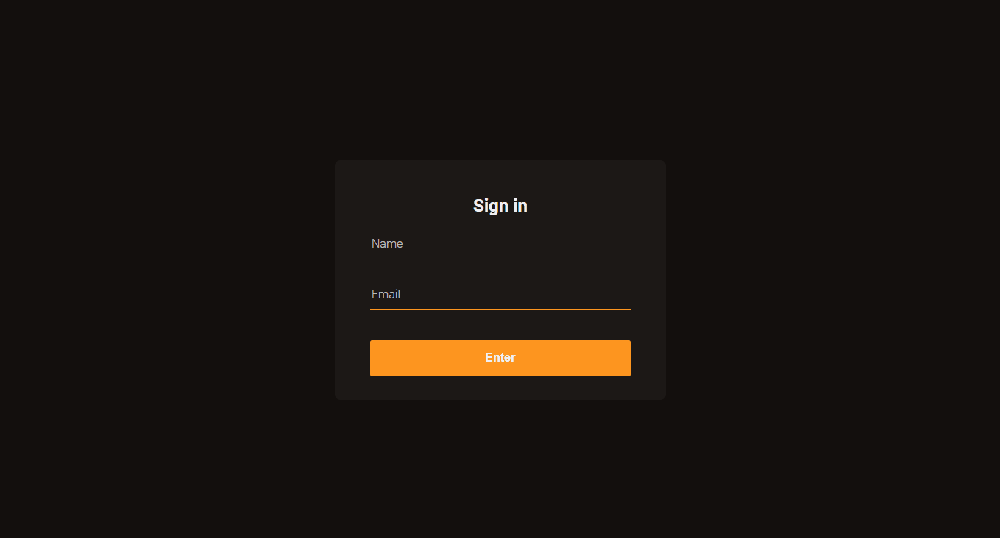

<h1 align="center">Custom Form Validation</h1>

<p align="center">Validating a form in a customized way using HTML and JS</p>

<p align="center">
    <a href="https://github.com/diego-aquino">
        
    </a>
        
    <a>
        
    </a>
    <a href="./LICENSE">
        
    </a>
</p>

<p align="center">
<a href="#rocket-features">Features</a>&nbsp;&nbsp;&nbsp;|&nbsp;&nbsp;&nbsp;
<a href="#gear-technologies">Technologies</a>&nbsp;&nbsp;&nbsp;|&nbsp;&nbsp;&nbsp;
<a href="#computer-getting-started">Getting started</a>&nbsp;&nbsp;&nbsp;|&nbsp;&nbsp;&nbsp;
<a href="#newspaper_roll-license">License</a>&nbsp;&nbsp;&nbsp;|&nbsp;&nbsp;&nbsp;
<a href="#handshake-acknowledgments">Acknowledgments</a>
</p>



## :rocket: Features

- Custom validation feedback
  - Warnings with custom messages according to the problem (e.g., 'Name is a required field' and 'Please enter a valid email' )
  - Colors to indicate input validity (green means valid, red means invalid)

## :gear: Technologies

This project was developed with the following technologies:

- [JavaScript](https://developer.mozilla.org/en-US/docs/Web/JavaScript)
- [HTML](https://developer.mozilla.org/en-US/docs/Web/HTML)
- [CSS](https://developer.mozilla.org/en-US/docs/Web/CSS)
- [VS Code](https://code.visualstudio.com/) + [ESLint](https://marketplace.visualstudio.com/items?itemName=dbaeumer.vscode-eslint) and [LiveServer](https://marketplace.visualstudio.com/items?itemName=ritwickdey.LiveServer)
- [ScreenToGif](https://www.screentogif.com/), used for recording demonstration GIFs.

## :computer: Getting started

To clone and run this application, you'll need [Git](https://git-scm.com/) and [Node.js](https://nodejs.org/en/) installed on your computer. Then, from your command line:

```bash
# clone this repository
$ git clone https://github.com/diego-aquino/custom-form-validation.git

# go to the created directory
$ cd custom-form-validation/

# install http-server package
$ npm install -g http-server

# start a local server
$ http-server
```

Now you can visit `http://localhost:8080` to view this project running!

## :newspaper_roll: License

This project if under MIT License. Check [LICENSE](./LICENSE) for more information.

## :handshake: Acknowledgments

Especial thanks to [@maykbrito](https://github.com/maykbrito) and [Rocketseat](https://rocketseat.com.br/) for the masterclass [Validação de forms customizada com HTML e JavaScript](https://www.youtube.com/watch?v=GTMEuHxh8aQ). You provided me lots of insights by building this project!

---

Made by [Diego Aquino](https://github.com/diego-aquino/) :sunglasses:. [Connect with me!](https://www.linkedin.com/in/diego-aquino) :wave:
